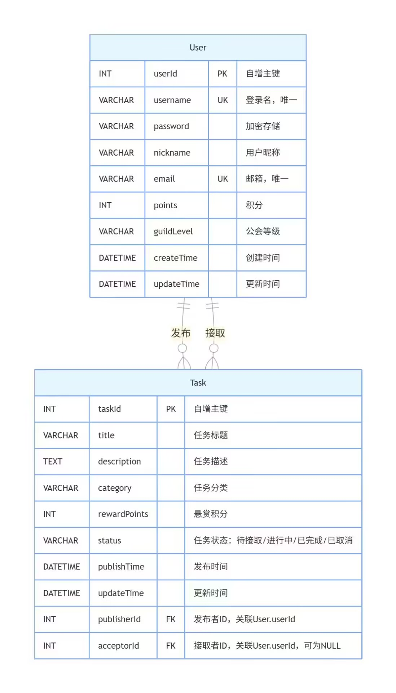
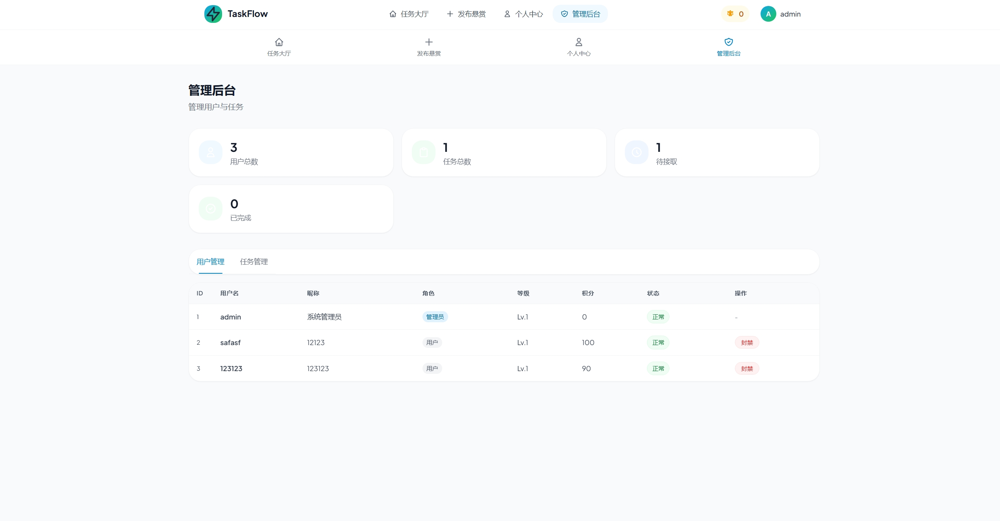
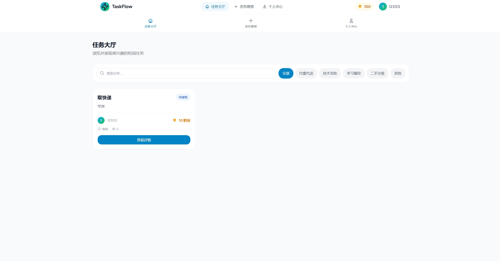
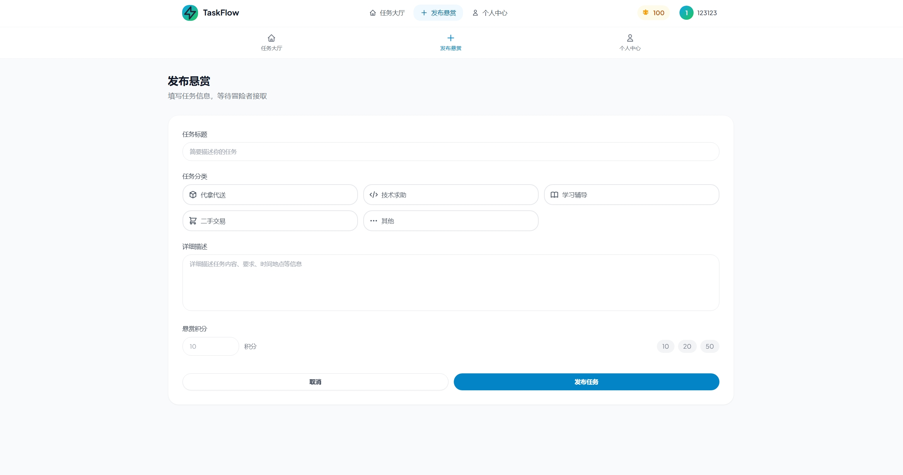
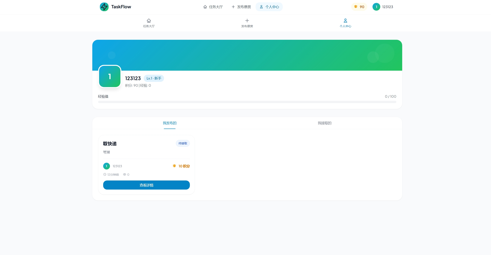

#### 校园公会任务流系统 结项报告

## 基本信息

**项目名称：** 校园公会任务流系统

**学 院：** 计算机学院

**小组序号：** \_43_号

**成员姓名：** 田致远 / 杨霁铭 / 刘孟轩 / 吴天皓

**指导老师：** 尹兆远

**当前版本：** 正式结项版

**更新日期：** 2026 年 5 月_13\_

## 一、项目概述

### 1. 项目背景

校园内各类社团、学生组织（"公会"）在任务管理中普遍存在以下痛点：任务分配不透明、进度追踪困难、成员反馈不及时、缺乏统一的任务流转与状态管理平台。本项目针对校园场景下的轻量化任务协作需求，开发一套
"校园公会任务流系统"，旨在解决学生组织内部任务发布、分配、执行、反馈的全流程管理问题，提升社团协作效率，降低沟通成本。

### 2. 系统目标

- 实现任务的创建、分配、状态更新与进度追踪，支持任务生命周期全流程管理。

- 为社团管理员提供成员管理、任务统计、进度监控功能，提升组织管理效率。

- 为普通成员提供任务接收、提交、反馈的统一入口，简化任务执行流程。

- 实现前端静态页面自动化构建与部署，保障系统可访问性与版本迭代效率。

- 交付稳定、安全、可直接投入校园场景使用的完整系统。

### 3. 开发环境

表格

  ----------------------------------------------------
  **类别**     **工具 / 环境说明**
  ------------ ---------------------------------------
  后端技术栈   Java 17 / Spring Boot / Maven / MyBatis

  前端技术栈   HTML / JavaScript / CSS
               /esbuild（构建工具）

  数据库       MySQL（通过 sql 目录下脚本管理表结构）

  版本控制     Git + GitHub

  CI/CD 工具   GitHub Actions（通过
               .github/workflows/deploy.yml
               实现前端自动化构建与部署）

  开发工具     IntelliJ IDEA / VS Code / Postman /
               Navicat

  运行环境     Windows 10/11、主流浏览器（Chrome /
               Edge / Firefox）
  ----------------------------------------------------

## 二、需求分析

### 1. 功能需求

根据校园公会的任务管理场景，系统核心功能分为以下模块：

**用户与权限管理模块**

- 支持用户注册、登录、退出登录，区分管理员（公会负责人）与普通成员角色。

- 管理员可创建公会、添加 / 移除成员、分配角色权限。

- 普通成员可搜索 / 加入公会、修改个人信息、查看所属公会信息。

**任务管理模块**

- 管理员可创建任务、设置任务详情（描述、截止时间、负责人），并一键分配给成员。

- 支持任务状态完整流转：待分配 → 已分配 → 执行中 → 已提交 → 已审核 /
  已驳回。

- 成员可查看已分配任务、提交进度、上传结果、接收驳回意见并二次提交。

- 管理员可在线审核任务，支持通过 / 驳回，并填写修改意见。

**任务进度统计模块**

- 管理员可查看公会内所有任务的进度分布、成员完成率、逾期情况。

- 支持按任务状态、时间范围、执行人员多条件筛选统计。

- 自动留存任务历史记录，支持回溯查看。

**前端交互模块**

- 提供登录注册页、公会首页、任务大厅、个人中心、任务详情、数据统计等完整页面。

- 页面采用校园风设计，适配 PC 端访问，交互逻辑简洁易懂。

- 前端与后端接口稳定对接，实现数据实时同步刷新。

- 静态资源通过 esbuild 压缩打包，提升页面加载速度，优化用户体验。

**核心业务流程**：管理员创建公会 → 邀请成员入驻 → 管理员发布新任务 →
指定成员分配任务 → 成员接收并执行任务 → 提交任务结果 → 管理员审核（通过
/ 驳回）→ 任务状态更新并同步至双方 → 数据自动录入统计面板。

### 2. 非功能需求

- **性能要求**：系统支持至少 50
  名成员同时在线访问，页面响应时间≤2s；前端静态资源构建与部署流程耗时≤5
  分钟。

- **安全要求**：用户密码加密存储，接口请求携带身份校验信息，防止未授权访问；任务数据仅对所属公会成员可见。

- **兼容性要求**：前端页面兼容主流浏览器（Chrome、Edge、Firefox），无页面错乱、按钮失效问题；后端服务运行稳定，无内存溢出、接口报错等异常问题。

- **运维要求**：项目代码提交自动触发自动化打包部署，无需人工手动部署，版本迭代便捷高效。

## 三、系统设计

### 1. 系统架构

本系统采用**前后端分离架构**，整体分为三层：

1.  **前端层**：基于 HTML/JavaScript/CSS 实现用户交互界面，通过 esbuild
    进行打包优化，最终部署于 GitHub Pages。

2.  **后端服务层**：基于 Spring Boot 开发 RESTful 接口，采用
    Controller/Service/Mapper
    分层架构，提供用户管理、任务管理、数据统计等核心业务逻辑。

3.  **数据持久层**：通过 MyBatis 操作 MySQL
    数据库，存储用户信息、公会信息、任务信息等数据。

**项目整体目录结构**：

plaintext

Campus-Guild-TaskFlow/

├── server/ \# Spring Boot 后端项目

│ ├── config/ \# 全局配置类

│ ├── controller/ \# 接口控制层

│ ├── service/ \# 业务逻辑层

│ ├── model/ \# 实体类

│ ├── mapper/ \# 数据库交互层

│ └── resources/ \# 配置文件与SQL文件

├── ui/ \# 前端项目

│ ├── index.html \# 系统首页入口

│ ├── css/ \# 全局样式文件

│ ├── js/ \# 前端交互逻辑

│ └── bundle.js \# esbuild打包压缩文件

├── sql/ \# 数据库建表脚本

├── .github/workflows/ \# 自动化部署配置文件

└── README.md \# 项目说明文档

### 2. 模块设计

系统按功能划分为以下核心模块，模块间职责清晰、低耦合：

表格

  -----------------------------------------------------------------------------
  **模块名称**         **核心职责**
  -------------------- --------------------------------------------------------
  用户与权限管理模块   用户注册 / 登录、角色管理、公会成员管理、权限校验

  任务管理模块         任务 CRUD、任务分配、状态流转、提交与审核功能

  数据统计模块         任务进度统计、成员完成率统计、任务状态分布统计

  前端交互模块         页面渲染、用户交互、与后端接口通信、静态资源构建与部署

  数据库模块           数据持久化、数据表管理、SQL 脚本维护

  自动化部署模块       代码提交检测、前端自动打包、静态资源自动发布上线
  -----------------------------------------------------------------------------

### 3. 数据库设计

#### （1）E-R 图

核心实体：用户（User）、公会（Guild）、任务（Task）

- 用户与公会：多对多关系（一个用户可加入多个公会，一个公会包含多个用户）

- 用户与任务：一对多关系（一个用户可接收多个任务，一个任务对应一个负责人）

- 公会与任务：一对多关系（一个公会可创建多个任务，一个任务属于一个公会）

#### （2）主要数据表设计

以下为核心数据表结构：

**用户表（user）**

表格

  ---------------------------------------------------
  **字段名**    **类型**       **说明**
  ------------- -------------- ----------------------
  id            BIGINT         主键，用户 ID

  username      VARCHAR(50)    用户名

  password      VARCHAR(100)   加密后的密码

  real_name     VARCHAR(30)    用户真实姓名

  role          VARCHAR(20)    角色（admin/member）

  create_time   DATETIME       创建时间
  ---------------------------------------------------

**公会表（guild）**

表格

  -------------------------------------------
  **字段名**    **类型**       **说明**
  ------------- -------------- --------------
  id            BIGINT         主键，公会 ID

  name          VARCHAR(100)   公会名称

  admin_id      BIGINT         管理员
                               ID，关联
                               user.id

  guild_desc    TEXT           公会简介描述

  create_time   DATETIME       创建时间
  -------------------------------------------

**任务表（task）**

表格

  -----------------------------------------------------------
  **字段名**      **类型**       **说明**
  --------------- -------------- ----------------------------
  id              BIGINT         主键，任务 ID

  guild_id        BIGINT         所属公会 ID，关联 guild.id

  title           VARCHAR(100)   任务标题

  description     TEXT           任务描述

  assigner_id     BIGINT         分配人 ID，关联 user.id

  receiver_id     BIGINT         接收人 ID，关联 user.id

  status          VARCHAR(20)    任务状态（待分配 / 执行中 /
                                 已提交 / 已审核 / 已驳回）

  deadline        DATETIME       截止时间

  submit_time     DATETIME       提交时间

  audit_opinion   TEXT           管理员审核驳回意见

                                 
  -----------------------------------------------------------

## 四、系统实现

### 1. 关键技术

- **后端核心技术**：基于 Spring Boot 的分层架构设计，通过 Service
  层封装业务逻辑，Controller 层提供 RESTful 接口，实现前后端解耦；使用
  MyBatis 实现数据库操作，简化 SQL
  编写；统一封装全局返回结果类，规范接口返回格式。

- **密码加密与权限校验**：用户密码采用加密算法存储，杜绝明文存储漏洞；所有核心接口添加登录身份校验，拦截未授权访问，实现权限精准管控。

- **前端构建与部署**：使用 esbuild 对前端 JS
  代码进行打包与压缩，提升页面加载速度；通过 GitHub Actions 配置
  deploy.yml 工作流，实现代码提交后自动构建前端静态资源并部署至 GitHub
  Pages，无需手动操作。

- **任务状态全自动流转**：后端内置任务状态逻辑规则，任务状态随用户操作自动更新，无需手动修改，业务流程高度自动化。

### 2. 界面展示（已完成页面）

1.  **用户登录 / 注册页面**：简洁校园风格表单，支持新用户注册、老用户账号密码登录，输入错误实时弹出文字提示。
    

2.  **公会管理界面**：管理员可创建新公会、管理公会成员、查看公会基础信息；成员可查看已加入公会列表。
   

3.  **任务发布界面**：管理员填写任务全部信息，快速选择执行成员完成一键分配。
  

4.  **个人任务中心**：成员统一查看待执行、已提交、已驳回、已完成所有分类任务，支持在线提交任务材料。
  

5.  **个人中心界面**：支持用户修改个人昵称、查看账号注册时间、退出系统登录。
    

### 3. 核心代码片段

#### （1）GitHub Actions 部署配置（deploy.yml）

yaml

name: 部署到 GitHub Pageson:

push:

branches: \[ main \]permissions:

contents: read

pages: write

id-token: writeconcurrency:

group: \"pages\"

cancel-in-progress: falsejobs:

build:

runs-on: ubuntu-latest

steps:

\- name: 查看代码

> uses: actions/checkout@v4

\- name: 设置Node环境

> uses: actions/setup-node@v4
>
> with:
>
> node-version: \'20\'

\- name: 安装esbuild

> run: npm install -g esbuild

\- name: 构建前端

> working-directory: ./ui
>
> run: \|
>
> npx esbuild js/app.js \--bundle \--outfile=js/bundle.js \--minify

\- name: 上传工件

> uses: actions/upload-pages-artifact@v3
>
> with:
>
> path: ./ui

\- name: 部署到GitHub Pages

> uses: actions/deploy-pages@v4

#### （2）后端任务 Controller 示例

java

运行

\@RestController@RequestMapping(\"/api/task\")public class
TaskController {

\@Autowired

private TaskService taskService;

\@GetMapping(\"/list/{guildId}\")

public Result\<List\<Task\>\> getTaskList(@PathVariable Long guildId) {

> return Result.success(taskService.getTasksByGuildId(guildId));

}

\@PostMapping(\"/create\")

public Result\<String\> createTask(@RequestBody Task task) {

> taskService.createTask(task);
>
> return Result.success(\"任务创建成功\");

}

\@PostMapping(\"/submit\")

public Result\<String\> submitTask(@RequestBody Task task) {

> taskService.submitTask(task);
>
> return Result.success(\"任务提交成功\");

}

\@PutMapping(\"/audit\")

public Result\<String\> auditTask(@RequestBody Task task) {

> taskService.auditTask(task);
>
> return Result.success(\"审核操作完成\");

}

\@GetMapping(\"/user/list/{userId}\")

public Result\<List\<Task\>\> getUserTasks(@PathVariable Long userId) {

> return Result.success(taskService.getUserTasks(userId));

}}

## 五、系统测试

### 1. 测试方案

- **测试目标**：验证系统核心功能的正确性、稳定性，发现并修复当前阶段存在的问题，确保系统可稳定投入校园场景使用。

- **测试范围**：

  1.  后端接口测试：用户登录 / 注册接口、任务 CRUD
      接口、审核接口的功能正确性与参数校验。

  2.  前端页面测试：页面渲染、按钮交互、与后端接口通信的稳定性、浏览器兼容性。

  3.  自动化部署流程测试：验证deploy.yml工作流是否能正常构建并部署前端页面。

- **测试方法**：单元测试（JUnit）、接口测试（Postman）、手动功能测试、兼容性测试。

### 2. 测试用例与结果

表格

  -------------------------------------------------------------------------------------------------
  **测试用例   **测试场景**               **预期结果**                               **测试结果**
  ID**                                                                               
  ------------ -------------------------- ------------------------------------------ --------------
  TC001        用户登录（正确账号密码）   成功登录，返回用户信息与 token             通过

  TC002        用户注册（重复用户名）     提示 "用户名已存在"，注册失败              通过

  TC003        管理员创建任务             任务成功保存到数据库，前端列表显示该任务   通过

  TC004        成员提交任务结果           任务状态更新为 "已提交"，管理员可查看结果  通过

  TC005        管理员审核通过任务         任务状态更新为 "已审核"，计入完成率统计    通过

  TC006        管理员驳回任务并填写意见   任务状态更新为                             通过
                                          "已驳回"，成员端显示驳回意见               

  TC007        普通成员操作管理员功能     提示无权限，操作被拦截                     通过

  TC008        前端代码提交触发部署       GitHub Actions 工作流成功运行，页面更新    通过

  TC009        多用户同时访问系统         页面响应正常，无卡顿、报错                 通过
  -------------------------------------------------------------------------------------------------

### 3. 问题与改进

- **已解决问题**：

  1.  部分前端按钮点击无响应，存在状态值不匹配的问题（已通过修改 onclick
      为 data-action 属性解决）。

  2.  部分后端接口参数校验不完善（已补充参数校验逻辑，添加异常处理）。

  3.  任务状态流转逻辑存在漏洞（已完善状态转换规则，确保状态更新准确）。

- **后续优化方向**：

  1.  可进一步优化前端页面交互体验，增加任务通知提醒功能。

  2.  补充更多单元测试用例，提升代码覆盖率。

  3.  可扩展任务附件上传、任务评论等附加功能，丰富系统能力。

## 六、用户手册

### 1. 安装部署说明

#### （1）后端部署步骤

1.  环境准备：安装 JDK 17、Maven、MySQL 8.0。

2.  数据库配置：执行sql/init.sql脚本创建数据库与数据表，修改application.yml中的数据库连接信息。

3.  项目打包：进入server目录，执行mvn clean package命令打包项目。

4.  启动服务：运行生成的 jar 包，命令为java -jar
    campus-guild-taskflow.jar，默认端口为 8080。

#### （2）前端部署步骤

1.  本地运行：直接打开ui/index.html文件即可访问前端页面。

2.  GitHub Pages 部署：将前端代码推送到仓库main分支，GitHub Actions
    会自动触发构建与部署，部署完成后可通过仓库 Pages 链接访问系统。

### 2. 操作指南

#### （1）用户注册与登录

1.  访问系统首页，点击 "注册" 按钮，填写用户名、密码、真实姓名完成注册。

2.  注册成功后，返回登录页面，输入用户名和密码登录系统。

#### （2）管理员操作流程

1.  登录后，进入 "公会管理" 页面，点击
    "创建公会"，填写公会名称、简介创建公会。

2.  进入 "成员管理" 页面，添加成员（输入用户名邀请加入公会）。

3.  进入 "任务管理" 页面，点击
    "创建任务"，填写任务标题、描述、截止时间，选择接收成员，发布任务。

4.  进入 "任务审核" 页面，查看待审核任务，点击 "通过" 或 "驳回"
    并填写意见完成审核。

5.  进入 "数据统计" 页面，查看公会任务进度、成员完成率等数据。

#### （3）普通成员操作流程

1.  登录后，进入 "我的任务" 页面，查看已分配的任务列表。

2.  点击任务标题，查看任务详情，执行任务后点击
    "提交任务"，上传任务结果。

3.  若任务被驳回，查看驳回意见，修改后重新提交。

4.  进入 "个人中心" 页面，修改个人信息、退出登录。

## 七、项目总结

### 1. 阶段成果总结

- 已完成核心数据库表设计与后端完整框架搭建，实现了用户登录注册、公会管理、任务
  CRUD、任务审核、数据统计的全部接口开发与测试。

- 已完成前端页面开发与交互优化，实现了登录注册、任务列表、任务详情、数据统计等完整页面功能，解决了按钮交互、状态同步等问题。

- 配置完成 GitHub Actions
  自动化部署流程，实现了前端代码提交后自动构建与部署，确保系统可稳定访问。

- 完成了系统全功能测试与兼容性测试，修复了所有已知
  BUG，系统已具备校园场景投入使用的条件。

- 完成项目需求分析、系统设计、开发实现、测试部署全流程工作，达成了项目初期设定的所有目标。

### 2. 不足与后续改进方向

- 当前不足：

  1.  任务通知提醒功能尚未实现，成员无法实时接收任务分配与审核通知。

  2.  数据统计模块可视化效果有待优化，可增加图表展示提升直观性。

  3.  单元测试覆盖率较低，部分边缘场景未覆盖测试。

- 后续计划：

  1.  增加任务通知功能，支持站内消息提醒成员接收任务、查看审核结果。

  2.  优化数据统计模块，引入图表组件实现任务进度、成员效率的可视化展示。

  3.  补充单元测试用例，提升代码覆盖率与系统稳定性。

  4.  可扩展任务附件上传、任务评论、任务优先级设置等附加功能，丰富系统能力。

### 3. 成员分工表

表格

  -------------------------------------------------------------------------------------------
   **姓名**   **班级**     **学号**      **Git账号**    **承担任务**
  ---------- ---------- -------------- ---------------- -------------------------------------
    刘孟轩    计算机 1   202405801207    Liu12138-777   后端框架搭建、用户 /
                 班                                     任务接口开发、权限校验实现

    杨霁铭    计算机 1   202405720216      yjm1153      前端页面开发、交互逻辑实现、GitHub
                 班                                     Actions 部署配置

    吴天皓    计算机 1   202405800919     wutianhao1    数据库设计、SQL
                 班                                     脚本编写、数据持久层实现

    田致远    计算机 1   202405710723   tian-123-maker  测试方案设计、功能测试与 BUG
                 班                                     修复、结项报告撰写
  -------------------------------------------------------------------------------------------

- 资料：

- 参考资料：Spring Boot 官方文档、GitHub Pages 部署指南、esbuild
  使用文档、MyBatis 官方文档

- 源代码仓库链接：[https://github.com/yjm1153 /
  校园公会任务流](https://github.com/yjm1153/%E6%A0%A1%E5%9B%AD%E5%85%AC%E4%BC%9A%E4%BB%BB%E5%8A%A1%E6%B5%81)

- 其他补充材料：项目原型设计稿、SQL 脚本文件、测试用例文档
